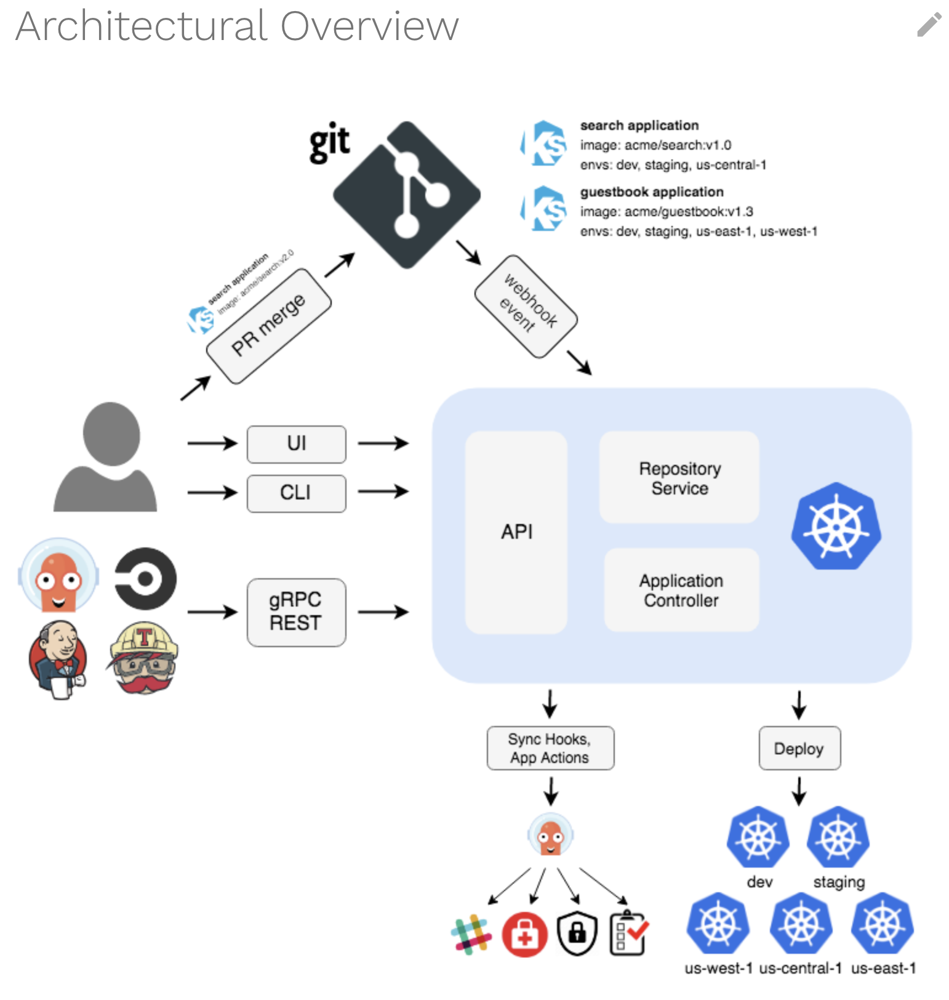

# ARGO WORKSHOP

## Information
Official ArgoCD [Docs](https://argo-cd.readthedocs.io/en/stable/)

Official Argo Workflows [Docs](https://argoproj.github.io/argo-workflows/)

## Introduction

Argo is a set of Kubernetes-native tools for deploying and managing Kubernetes workloads such as job, application, etc ... .

- Argo Workflow: Container native workflow engine
- Argo Events: Event-based dependency manager
- ArgoCD: Declarative GitOPS Continous Delivery
- Argo Rollout: Declaritive Progressive Delivery and Experimantation



Instruction of [Declarative Setup](https://argo-cd.readthedocs.io/en/stable/operator-manual/declarative-setup/#quick-reference)

API Server: Exposes the API for the WebUI / CLI / CICD Systems

Repository Server: Internal service which maintains a local cache of the git repository holding the application manifests

Application Controller: Kubernetes controller which controls and monitors applications continuously and compares that current live state with desired target state (specified in the repository). If a OutOfSync is detected, it will take corrective actions.

## Install Argo CD

```bash
kubectl create namespace argocd
kubectl apply -n argocd -f https://raw.githubusercontent.com/argoproj/argo-cd/v2.5.0/manifests/install.yaml
```

HA:

```bash
kubectl create namespace argocd
kubectl apply -n argocd -f https://raw.githubusercontent.com/argoproj/argo-cd/v2.5.0/manifests/ha/install.yaml
```

```bash
helm repo add argo-cd https://argoproj.github.io/argo-helm
helm dep up
helm install argocd argo-cd/argo-cd --namespace argocd --create-namespace
```

## Install Argo CD CLI
```bash
sudo curl --silent --location -o /usr/local/bin/argocd https://github.com/argoproj/argo-cd/releases/download/v2.5.0/argocd-linux-amd64

sudo chmod +x /usr/local/bin/argocd
```
argocd-darwin-amd64

## Login
```bash
export ARGOPWD=`kubectl -n argocd get secret argocd-initial-admin-secret -o jsonpath="{.data.password}" | base64 -d`
argocd login localhost:8080 --username admin --password $ARGOPWD --insecure
```

## Deploy Application
```bash
helm create nginx-helm
```

```
cat <<EOF | kubectl create -f -
apiVersion: argoproj.io/v1alpha1
kind: Application
metadata:
  name: wordpress
  namespace: argocd
spec:
  project: default
  source:
    chart: wordpress
    repoURL: https://charts.bitnami.com/bitnami
    targetRevision: 15.2.6
    helm:
      releaseName: wordpress
  destination:
    server: "https://kubernetes.default.svc"
    namespace: wordpress
EOF
```

```bash
cat <<EOF | kubectl apply -f -
apiVersion: argoproj.io/v1alpha1
kind: Application
metadata:
  name: guestbook
  namespace: argocd
spec:
  destination:
    namespace: default
    server: https://kubernetes.default.svc
  project: default
  source:
    path: guestbook
    repoURL: https://github.com/argoproj/argocd-example-apps.git
    targetRevision: HEAD
EOF
```

```bash
cat <<EOF | kubectl apply -f -
apiVersion: argoproj.io/v1alpha1
kind: Application
metadata:
  name: nginx
  namespace: argocd
spec:
  destination:
    namespace: default
    server: https://kubernetes.default.svc
  project: default
  source:
    path: nginx
    repoURL: https://github.com/erikorigoss/argocd-workshop.git
    targetRevision: HEAD
EOF
```

```bash
cat <<EOF | kubectl apply -f -
apiVersion: argoproj.io/v1alpha1
kind: Application
metadata:
  name: nginx-helm
  namespace: argocd
spec:
  destination:
    namespace: default
    server: https://kubernetes.default.svc
  project: nginx-helm
  source:
    path: nginx-helm
    repoURL: https://github.com/erikorigoss/argocd-workshop.git
    targetRevision: HEAD
EOF
```

```
apiVersion: argoproj.io/v1alpha1
kind: Application
spec:
  syncPolicy:
    syncOptions:
    - ApplyOutOfSyncOnly=true
```

```
apiVersion: argoproj.io/v1alpha1
kind: Application
spec:
  syncPolicy:
    syncOptions:
    - Replace=true
```

```
apiVersion: argoproj.io/v1alpha1
kind: Application
metadata:
  namespace: test
spec:
  syncPolicy:
    syncOptions:
    - CreateNamespace=true
```

```
spec:
  syncPolicy:
    automated:
      prune: true
      allowEmpty: true
```

```spec:
  syncPolicy:
    automated:
      selfHeal: true
```

```
cat <<EOF | kubectl apply -f -
apiVersion: argoproj.io/v1alpha1
kind: Application
metadata:
  name: nginx-automated
  namespace: argocd
spec:
  destination:
    namespace: default
    server: https://kubernetes.default.svc
  project: default
  source:
    path: nginx
    repoURL: https://github.com/erikorigoss/argocd-workshop.git
    targetRevision: HEAD
  syncPolicy:
    automated:
      selfHeal: true
EOF
```